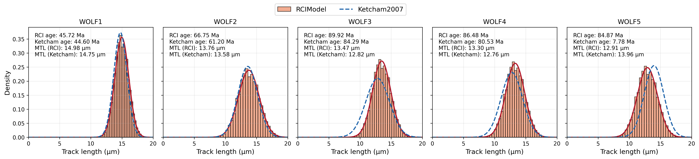
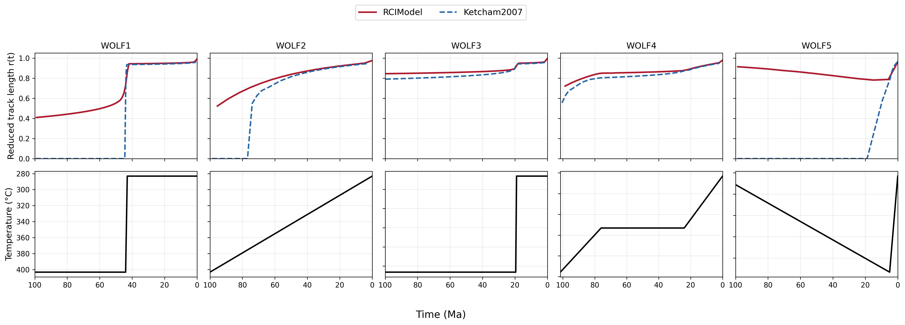

.. image:: https://raw.githubusercontent.com/rbeucher/pyFTracks/master/docs/images/logo.png
    :align: center

=====================================================
RCI-based annealing engine for pyFTracks (experimental)
=====================================================

This repository is a fork of **pyFTracks** that includes an experimental
implementation of the **Rate Constant Integral (RCI)** framework for
fission-track annealing, as developed in:

- Rufino & Guedes (2022)
- Rufino et al. (2023)
- Rufino et al. (2026)

The purpose of this fork is to provide a **controlled and reproducible
comparison** between classical PET-based annealing models (e.g.
Ketcham 1999, Ketcham 2007) and a **physically consistent,
history-dependent kinetic formulation**, without modifying the original
pyFTracks infrastructure.

This implementation is intended for **forward modelling and diagnostic
tests**. Geological interpretation and inverse modelling are not yet
addressed.

-----------------------------------------------------
What is new in this fork
-----------------------------------------------------

- A standalone **RCI annealing engine implemented in C**;
- A new ``RCIModel`` class fully integrated into the pyFTracks workflow;
- Forward modelling **without the Principle of Equivalent Time (PET)**;
- One-to-one comparisons with Ketcham1999/Ketcham2007 under identical
  thermal histories and kinetic parameters;
- Explicit preservation of thermal-history memory in non-parallel
  (fanning-type) kinetic regimes.

-----------------------------------------------------
What is unchanged
-----------------------------------------------------

- Original pyFTracks thermal-history definitions
  (e.g. ``WOLF1``–``WOLF5``);
- Viewer, plotting and visualization tools;
- AFT statistical routines (central age, pooled age, chi-square test);
- Existing empirical annealing models implemented in pyFTracks.

-----------------------------------------------------
Example results: WOLF thermal histories
-----------------------------------------------------

The figures below illustrate forward-modelling comparisons between the
RCI model and the Ketcham2007 model using standard WOLF thermal histories
provided in the pyFTracks manual.

These examples are intended as **diagnostic benchmarks**, not as
geological interpretations. All simulations use identical thermal
histories and kinetic parameters.

In histories WOLF1–WOLF4, both models exhibit broadly consistent
behavior, with systematic but moderate differences in predicted ages
and track-length distributions.

History WOLF5 highlights a stronger contrast between PET-based and
RCI-based formulations, reflecting the impact of thermal-history
dependence in non-parallel kinetic regimes.

-----------------------------------------------------
Status and scope
-----------------------------------------------------

- This implementation is **experimental** and under active development;
- The current focus is forward modelling and controlled benchmarking;
- Inverse modelling and geological applications will be addressed in
  future work;
- The code is provided to enable transparent comparison between kinetic
  formulations within a common computational framework.

================================================
Original pyFTracks README
================================================

pyFTracks is a Python utility which predicts fission-track ages and
track-length distributions for given thermal histories and kinetic
parameters. It is an open-source alternative to programs such as
AFTSolve or HeFTy developed by Richard Ketcham and described in
Ketcham (2000, 2005).

We provide the code in the hope that it will be useful to the community.

We have chosen Python to allow interaction with the broad range of
scientific libraries available in that language. Python is becoming a
language of choice for teaching programming and for research workflows,
such as rapid prototyping and interactivity.

------------
Installation
------------

The code is available on PyPI and should work on Linux, macOS and Windows.
To install it, run:

.. code:: bash

    pip install pyFTracks

You can also install the package from the latest GitHub source:

.. code:: bash

    pip install git+https://github.com/rbeucher/pyFTracks.git

------------
Dependencies
------------

- Python >= 3.5
- Cython >= 0.29.14
- matplotlib >= 3.1.1
- numpy >= 1.17.4
- scipy >= 1.3.2
- pandas >= 0.25.3
- tables >= 3.6.1

-----------
Recommended
-----------

- Jupyter Notebook

---------
Licensing
---------

pyFTracks is an open-source project licensed under the MIT License.
See LICENSE.md for details.

------------
Contact
------------

Dr. Romain Beucher  
The Australian National University  
romain.beucher@anu.edu.au
